# Tarea3-html
<!DOCTYPE html>
<html lang="en">
   <head>
      <meta charset="UTF-8">
      <meta name="viewport" content="width-device-widht, initial-scale=1-0">
      <title>El Almejario</title>

      <!-- stylessheet css file link -->
      <link rel="stylesheet" href="./estilos.css" />

      <!-- stylessheet link -->
      <link rel="stylesheet" href="./estilos.css" />

      <!-- fonts Fira Google fonts-->
      <link rel="preconnect" href="https://fonts.googleapis.com">
      <link rel="preconnect" href="https://fonts.gstatic.com" crossorigin>
      <link href="https://fonts.googleapis.com/css2?family=Fira+Sans:ital,wght@0,100;0,200;0,300;0,400;0,500;0,600;0,700;0,800;0,900;1,100;1,200;1,300;1,400;1,500;1,600;1,700;1,800;1,900&family=Pacifico&display=swap" rel="stylesheet">
   
      <!-- Conexión con Bootstrap por CDN -->
      <link rel="stylesheet" href="https://cdn.jsdelivr.net/npm/bootstrap@5.0.0/dist/css/bootstrap.min.css">

    </head>

    <body>
        <header>
            <nav>
                

                    
                

                

                    <ul>
                        <li><a href="#">Inicio</a></li>
                        <li><a href="#">Acerca de</a></li>
                        <li><a href="#">Sabores</a></li>
                        <li><a href="#">Galería</a></li>
                        <li><a href="#">Contacto</a></li>
                        

                            <button><svg xmlns="http://www.w3.org/2000/svg" x="0px" y="0px" width="30" height="30" viewBox="0,0,256,256">
                                <g transform=""><g fill-opacity="0" fill="#dddddd" fill-rule="nonzero" stroke="none" stroke-width="1" stroke-linecap="butt" stroke-linejoin="miter" stroke-miterlimit="10" stroke-dasharray="" stroke-dashoffset="0" font-family="none" font-weight="none" font-size="none" text-anchor="none" style="mix-blend-mode: normal"><path d="M0,256v-256h256v256z" id="bgRectangle"></path></g><g fill="#ffffff" fill-rule="nonzero" stroke="none" stroke-width="1" stroke-linecap="butt" stroke-linejoin="miter" stroke-miterlimit="10" stroke-dasharray="" stroke-dashoffset="0" font-family="none" font-weight="none" font-size="none" text-anchor="none" style="mix-blend-mode: normal"><g transform="scale(5.12,5.12)"><path d="M16,3c-7.14545,0 -13,5.85455 -13,13v18c0,7.14545 5.85455,13 13,13h18c7.14545,0 13,-5.85455 13,-13v-18c0,-7.14545 -5.85455,-13 -13,-13zM16,5h18c6.05454,0 11,4.94545 11,11v18c0,6.05454 -4.94546,11 -11,11h-18c-6.05455,0 -11,-4.94546 -11,-11v-18c0,-6.05455 4.94545,-11 11,-11zM37,11c-1.1,0 -2,0.9 -2,2c0,1.1 0.9,2 2,2c1.1,0 2,-0.9 2,-2c0,-1.1 -0.9,-2 -2,-2zM25,14c-6.04545,0 -11,4.95454 -11,11c0,6.04546 4.95454,11 11,11c6.04546,0 11,-4.95454 11,-11c0,-6.04545 -4.95454,-11 -11,-11zM25,16c4.95454,0 9,4.04546 9,9c0,4.95454 -4.04546,9 -9,9c-4.95454,0 -9,-4.04546 -9,-9c0,-4.95454 4.04546,-9 9,-9z"></path></g></g></g>
                                </svg>
                            </button>
                            <button><svg xmlns="http://www.w3.org/2000/svg" x="0px" y="0px" width="30" height="30" viewBox="0,0,256,256">
                                <g transform=""><g fill-opacity="0" fill="#dddddd" fill-rule="nonzero" stroke="none" stroke-width="1" stroke-linecap="butt" stroke-linejoin="miter" stroke-miterlimit="10" stroke-dasharray="" stroke-dashoffset="0" font-family="none" font-weight="none" font-size="none" text-anchor="none" style="mix-blend-mode: normal"><path d="M0,256v-256h256v256z" id="bgRectangle"></path></g><g fill="#ffffff" fill-rule="nonzero" stroke="none" stroke-width="1" stroke-linecap="butt" stroke-linejoin="miter" stroke-miterlimit="10" stroke-dasharray="" stroke-dashoffset="0" font-family="none" font-weight="none" font-size="none" text-anchor="none" style="mix-blend-mode: normal"><g transform="scale(5.12,5.12)"><path d="M9,4c-2.74952,0 -5,2.25048 -5,5v32c0,2.74952 2.25048,5 5,5h16.83203c0.10799,0.01785 0.21818,0.01785 0.32617,0h5.67383c0.10799,0.01785 0.21818,0.01785 0.32617,0h8.8418c2.74952,0 5,-2.25048 5,-5v-32c0,-2.74952 -2.25048,-5 -5,-5zM9,6h32c1.66848,0 3,1.33152 3,3v32c0,1.66848 -1.33152,3 -3,3h-8v-14h3.82031l1.40039,-7h-5.2207v-2c0,-0.55749 0.05305,-0.60107 0.24023,-0.72266c0.18718,-0.12159 0.76559,-0.27734 1.75977,-0.27734h3v-5.63086l-0.57031,-0.27149c0,0 -2.29704,-1.09766 -5.42969,-1.09766c-2.25,0 -4.09841,0.89645 -5.28125,2.375c-1.18284,1.47855 -1.71875,3.45833 -1.71875,5.625v2h-3v7h3v14h-16c-1.66848,0 -3,-1.33152 -3,-3v-32c0,-1.66848 1.33152,-3 3,-3zM32,15c2.07906,0 3.38736,0.45846 4,0.70117v2.29883h-1c-1.15082,0 -2.07304,0.0952 -2.84961,0.59961c-0.77656,0.50441 -1.15039,1.46188 -1.15039,2.40039v4h4.7793l-0.59961,3h-4.17969v16h-4v-16h-3v-3h3v-4c0,-1.83333 0.46409,-3.35355 1.28125,-4.375c0.81716,-1.02145 1.96875,-1.625 3.71875,-1.625z"></path></g></g></g>
                                </svg>
                            </button>
                        

                    </ul>
              

            </nav>
        
        </header>
     <main>

            <section id="content">
                <section="intro">
                    <h1>Sabores para el alma</h1>
                    
“Disfruta, come y bebe que la vida es breve”.

                    <a href="" class="boton">
                     ¡ELIGE TU FAVORITO!
                    </a>
                </section>  
             
    </main>
       
        
            <section class="container top-products">
                <h2 class="heading-1">Sabores</h2>
                

            </section>
        
               

                

                    <article>
                        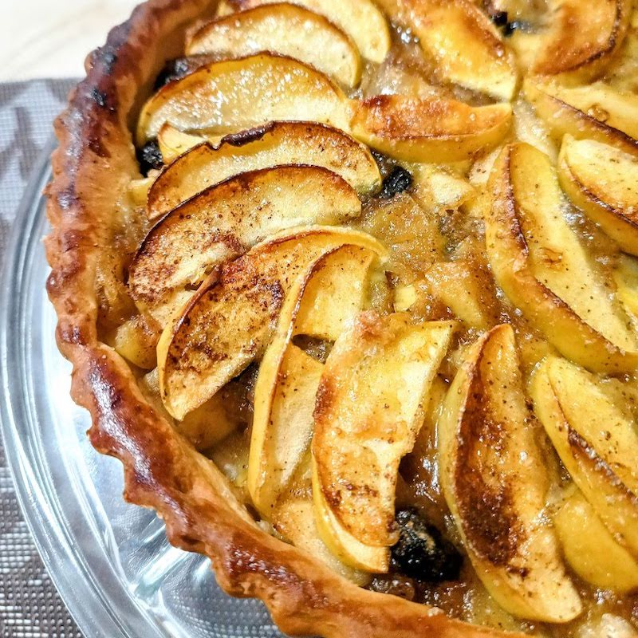
                        <h2>Dulce tentación</h2>
                        <h3>Tarta de manzana</h3>
                        <section>
                            <button>-</button>
                            0
                            <button>+</button>
                        </section>
                    </article>
                    <article>
                        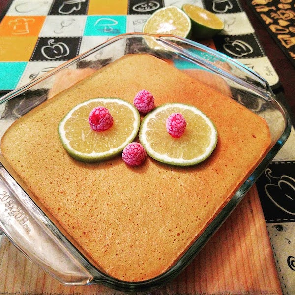
                        <h2>Dulce tentación</h2>
                        <h3>Pan de narnaja</h3>
                        <section>
                            <button>-</button>
                            0
                            <button>+</button>
                        </section>
                    </article>
                    <article>
                        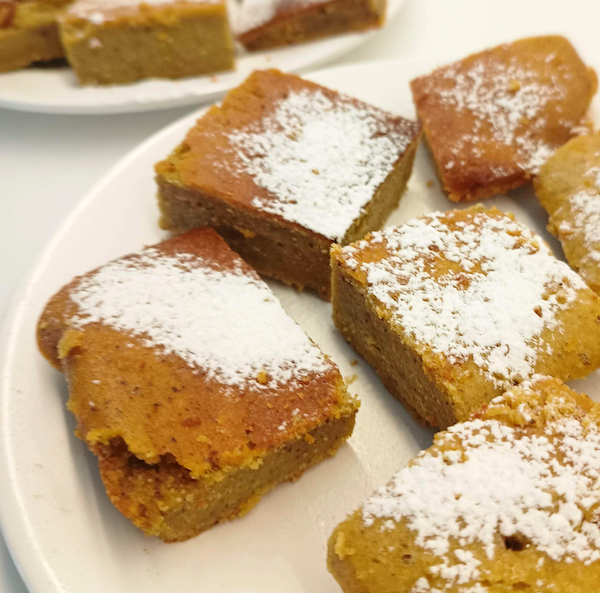
                        <h2>Dulce tentación</h2>
                        <h3>Panque de calabaza</h3>
                        <section>
                            <button>-</button>
                            0
                            <button>+</button>
                        </section>
                    </article>
                    <article>
                        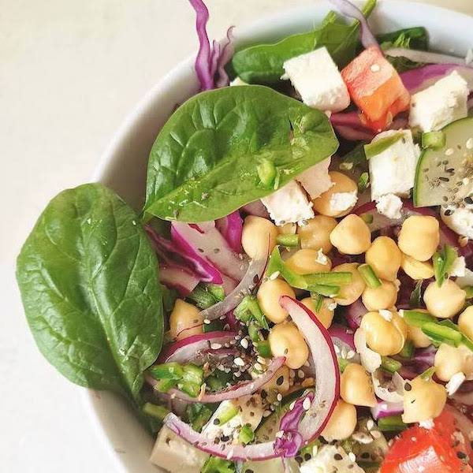
                        <h2>Te quiero verde</h2>
                        <h3>Ensalada mixta</h3>
                        <section>
                            <button>-</button>
                            0
                            <button>+</button>
                        </section>
                    </article>
                    <article>
                        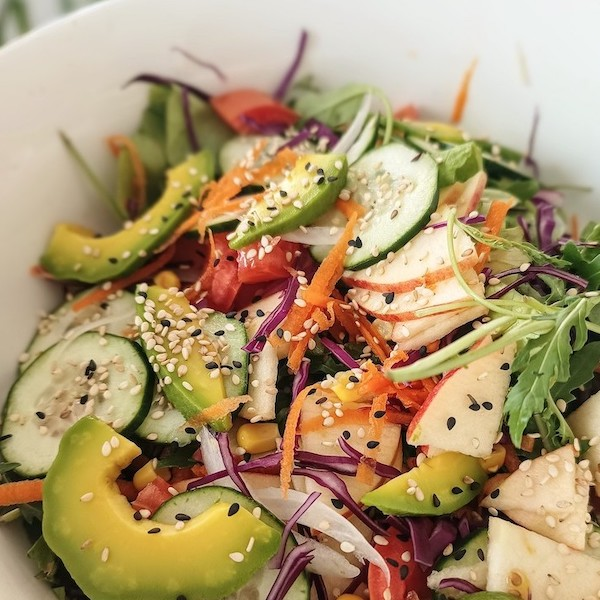
                        <h2>Te quiero verde</h2>
                        <h3>Ensalada primavera</h3>
                        <section>
                            <button>-</button>
                            0
                            <button>+</button>
                        </section>
                    </article>
                    <article>
                        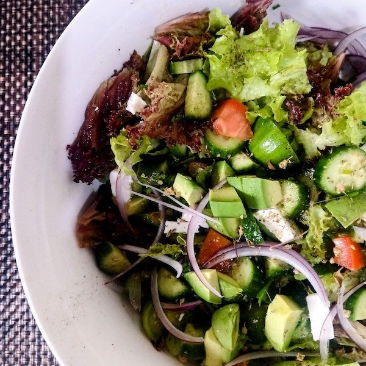
                        <h2>Te quiero verde</h2>
                        <h3>Ensalda mediterránea</h3>
                        <section>
                            <button>-</button>
                            0
                            <button>+</button>
                        </section>
                    </article>
                    <article>
                        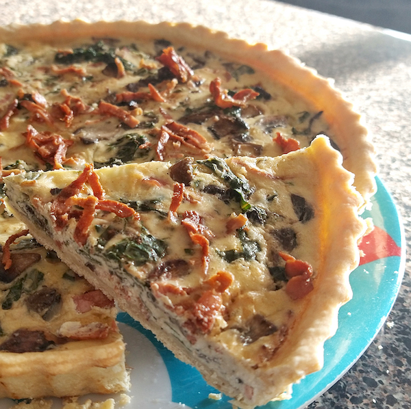
                        <h2>La sal de la vida</h2>
                        <h3>Quiché de espinacas</h3>
                        <section>
                            <button>-</button>
                            0
                            <button>+</button>
                        </section>
                    </article>
                    <article>
                        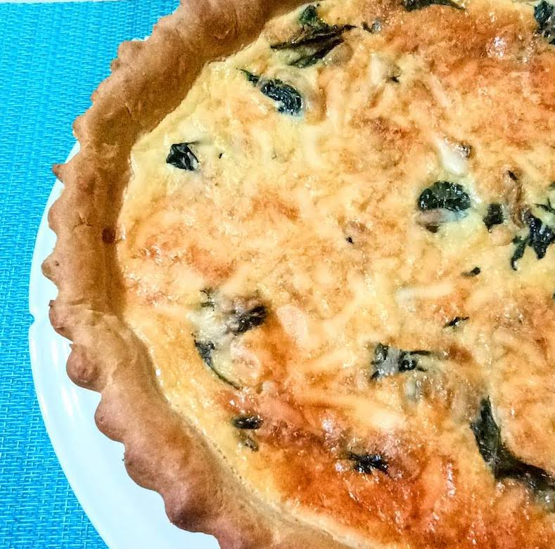
                        <h2>La sal de la vida</h2>
                        <h3>Quiché de tocino</h3>
                        <section>
                            <button>-</button>
                            0
                            <button>+</button>
                        </section>
                    </article>
                    <article>
                        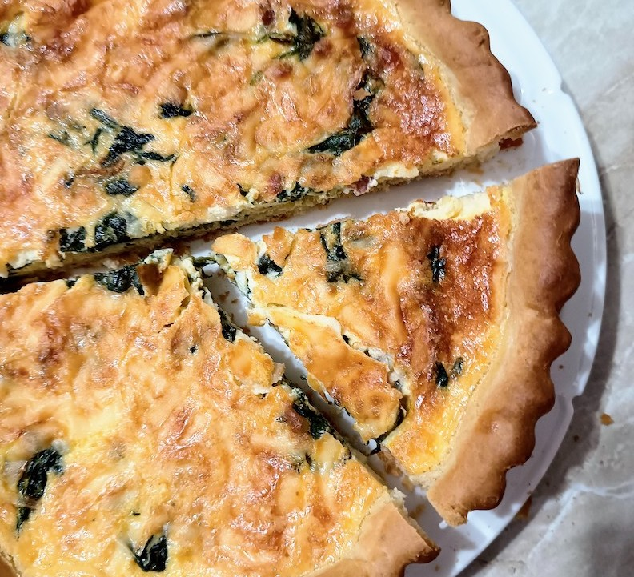
                        <h2>La sal de la vida</h2>
                        <h3>Quiché de chaya y champiñones</h3>
                        <section>
                            <button>-</button>
                            0
                            <button>+</button>
                        </section>
                    </article>
                    <article>
                        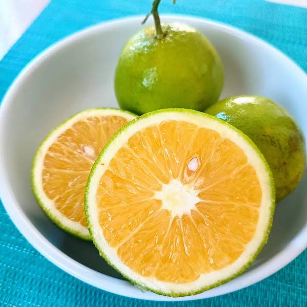
                        <h2>Temporadas</h2>
                        <h3>Ingredientes frescos</h3>
                        <section>
                            <button>-</button>
                            0
                            <button>+</button>
                        </section>
                    </article>
                    <article>
                        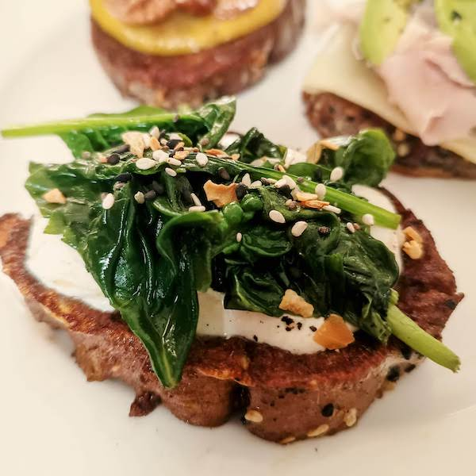
                        <h2>Desayunos</h2>
                        <h3>Toast de espinacas</h3>
                        <section>
                            <button>-</button>
                            0
                            <button>+</button>
                        </section>
                    </article>
                    <article>
                        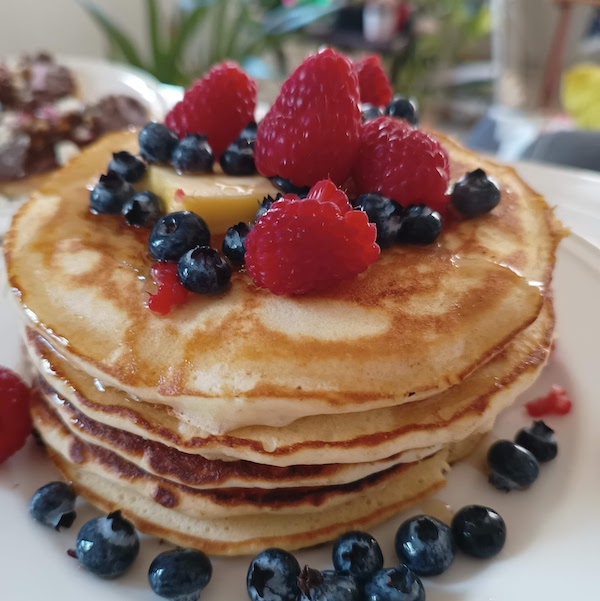
                        <h2>Desayunos</h2>
                        <h3>Hot cakes con frutos rojos</h3>
                        <section>
                            <button>-</button>
                            0
                            <button>+</button>
                        </section>
                    </article>
                

             <section class="galleryp">
                <h2 class="heading-1">Galería</h2>
                

            </section>

        

                    

                        
                    

                    

                        
                    

                    

                        
                    

                    

                        
                    

                    

                        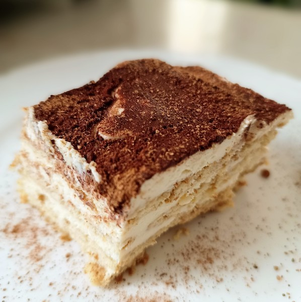
                    

                    

                        
                    

                    

                        
                    

                    

                        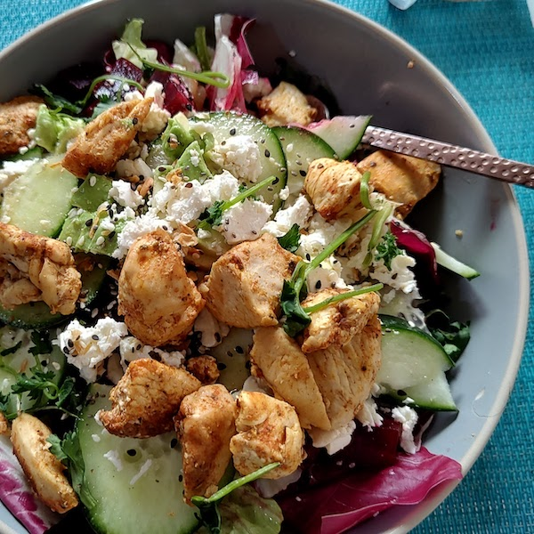
                    

                    

                        
                    

    

    

     
        <footer>
        
 &copy 2024. El Almejario y Q•Ko Cocina son marcas registradas. Todos los derechos reservados

        </footer>

    </body>

</html>
